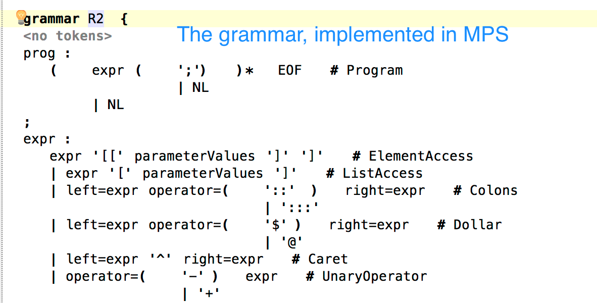
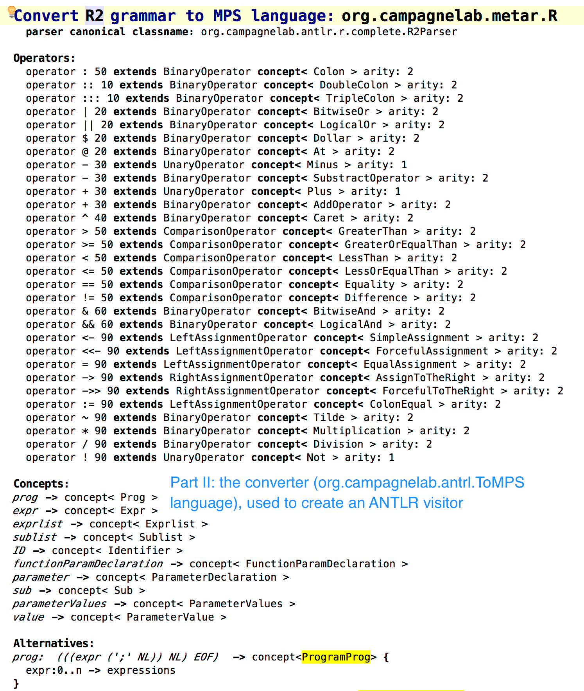

# ANTRL_MPS
An ANTRL language for MPS, and the ToMPS language to help create MPS languages and ANTRL visitors from an ANTLR 4 grammar. 

This project is based on the MPS platform. It may be useful if you aim to implement a language in MPS for which an ANTRL grammar and parser are available. Take a look at the http://metar.campagnelab.org project for an application where we developed an MPS language from the R ANTRL v4 grammar. A [tutorial](Tutorial.pdf) is also available.

